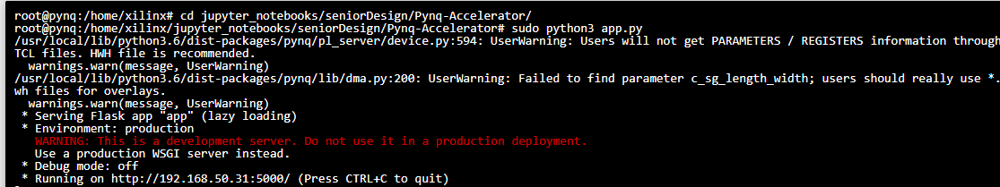

# Senior Design Project Foundation
## Setup

1. Gather Pynq Z1 or Z2 board
2. Gather micro SD card and ensure you can flash this SD card, such as with this [kit from Amazon](https://www.amazon.com/SanDisk-Extreme-microSD-UHS-I-Adapter/dp/B07FCMBLV6/ref=sr_1_3?crid=28HBXJW9BDM4X&dib=eyJ2IjoiMSJ9.ltxMMRv20B8Ib6iJzCkWb01RY76XZbc9oF3TC2dYZIdA4jLAE5WepgwlRN6ykYJ2rUTux1BrIghI3dEWO1eZTUVNCQ71TSa2U_0Z0eE_9p9KwHZxEX1YYaTh8rJC8JC3VmhNnEiRVLjxCTIN6sNUH9hkr6ULEr_G8YJKUCFZQYP2MJ85IDXgZ8APyFc7zg__WPkxL1viQuNIgXQeUAd3bLI4gzaevrhg_KfkhLjjWFk.aQa8ly4xjlqRvwgcgHdWgAYu1miUKWD9WsAfbYRlrsw&dib_tag=se&keywords=micro%2Bsd%2Bcard%2Bwith%2Badapter&qid=1740422220&sprefix=micro%2Bsd%2Bcard%2Bwith%2B%2Caps%2C114&sr=8-3&th=1)
3. Follow this guide to initialize Pynq Board: [Docs](https://pynq.readthedocs.io/en/v2.5/getting_started/pynq_z2_setup.html)
4. Download Zip of V2.5 SD card image from [this website](https://www.tulembedded.com/FPGA/ProductsPYNQ-Z2.html)
5. Download [Belena Etcher](https://etcher.balena.io/) to flash sd card 
6. Set up [SSH keys](https://docs.github.com/en/authentication/connecting-to-github-with-ssh/generating-a-new-ssh-key-and-adding-it-to-the-ssh-agent?platform=windows) on github account: 
7. Connect Pynq to wifi router, and navigate to pynq:9090 in a browser with access to the same network. The password is xilinx
8. Once set up, download this repo and its requirements
```bash
git clone git@github.com:kevingonz19/Pynq-Accelerator.git
cd Pynq-Accelerator
pip3 install -r ./requirement.txt
```
9. Use this command to note your Pynq board IP address which should start with 192.168.50.XX. If not, then discover your host IP address on the Pynq board and take note of it
```bash
hostname -I
```

## In Order To Run The Application
1. This project works by hosting a Flask app on the Pynq board found at [Pynq-Accelerator/app.py](https://github.com/kevingonz19/Pynq-Accelerator/blob/4c9e8c8b55ed20215b8efce400a3750c153029ff/app.py#L38). Here, alter the IP address to be what you noted earlier. Do so on the Pynq board  
2. On Pynq, run the following command:
```bash
sudo python3 app.py
```  
You should see something like this on pynq:
     

3. Finally, download this repo on your desktop to open the web app. Alter the IP address found in [index.js](https://github.com/kevingonz19/Pynq-Accelerator/blob/4c9e8c8b55ed20215b8efce400a3750c153029ff/WebApp/index.js#L86) to be what you noted earlier in order to connect to the Pynq board correctly. Then, open [index.html](https://github.com/kevingonz19/Pynq-Accelerator/blob/master/WebApp/index.html) on this desktop and test out the app


## from the old forked project: 

## How to Use

For more introduction of the Accelerator Design, you can dive deeply into this [project](https://github.com/mfarhadi/CNNIOT), but for a quick start, you just need `Bitstream.tcl` and `Bitstream.bit` and we had provided it under `LeNet` Floder.

### Setup the environment

#### Pynq side:

You should ensure your pynq board can connect to the internet, if you have some issues of this topic, maybe [this blog](https://leiblog.wang/Embedding-board-internet-via-PC-Ethernet/) will help you. And, execute command below in your shell.

```bash
sudo apt-get update && sudo apt-get install -y git
git clone https://github.com/LeiWang1999/Pynq-Accelerator
cd Pynq-Accelerator
pip install -r ./requirement.txt
```

#### Host side:

```bash
git clone https://github.com/LeiWang1999/Pynq-Accelerator
```

And, you should use make sure that your computer can connect the pynq board, to find the ip address in pynq/linux execute:

```bash
ifconfig | grep inet4
```

and to find ipaddress on windows:

```bash
ipconfig /all
```

For my environment, I use Ethernet to connect my board and host computer:


### Run the Application

#### Pynq side:

To run this application , you can execute this command:

```bash
sudo python3 app.py
```

#### Host side:

To run this application, open [index.html](https://github.com/LeiWang1999/Pynq-Accelerator/blob/master/WebApp/index.html) in your browser.

And you should also custom this request [url](https://github.com/LeiWang1999/Pynq-Accelerator/blob/master/WebApp/index.js#L84) to your pynq board ip, for me the `127.0.0.1` just because I use Vscode RemoteSSH Plugin, and it can automatic forward board ip to localhost. But for you not with vscode, you should change the `127.0.0.1` to your boads ip, like `192.168.2.99`.

## Reference

1. [CNNIOT](https://github.com/mfarhadi/CNNIOT): lightweight deep learning framework in python.

2. [Flask](https://dormousehole.readthedocs.io/en/latest/): Micro python web framework.

